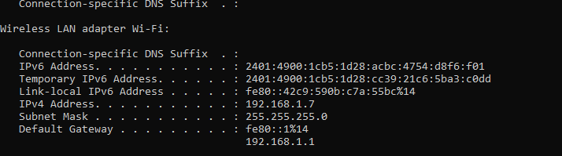

Steps to Run the Quiz Application

Install the Expo Android app on your smartphone

https://play.google.com/store/apps/details?id=host.exp.exponent

To start the project, first clone or unzip the code from GitHub

https://github.com/rohithsingh1/QuizApplication-React-Native.git

Navigate to the local directory where you want to clone the repository.

Once you cloned the repository.

Install Dependencies

npm install

To start the backend Server

npm start

To start the frontend(React-native)

cd quiz-project

First update with the IpAddress of your local Machine in the "quiz-project/src/apicalls/Index.js" file.

Command to know the IpAddress of your local Machine: ipconfig

Once updated with the IpAddress

Install Dependencies

npm install

To start the front

npm start

Scan the QRCode in the Expo Android application